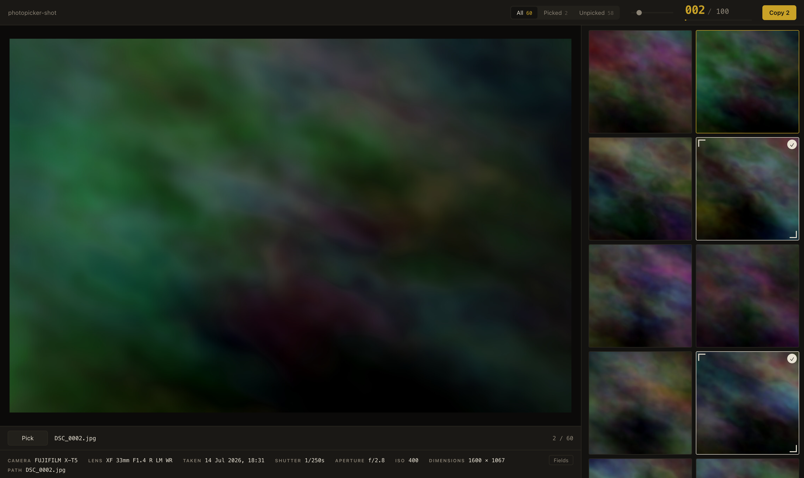
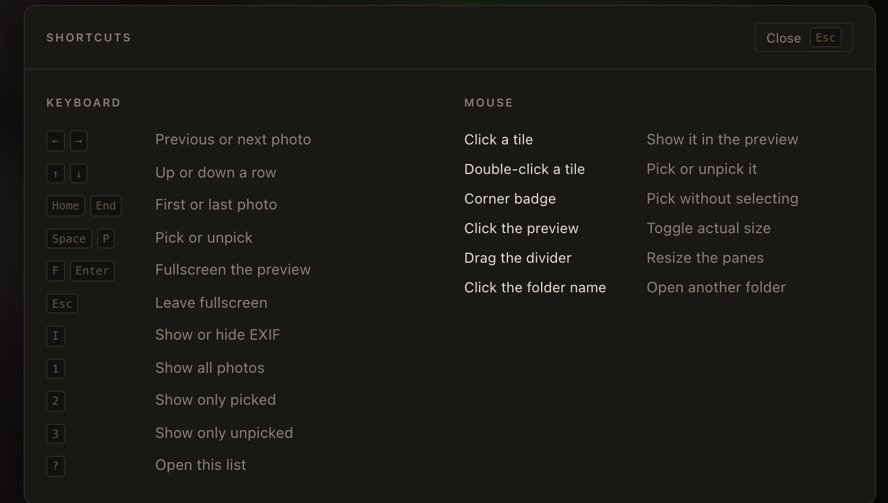

# Photopicker

A local tool for culling a large folder of photos down to a fixed number, built for the
case of "I have 2000 pictures and I need to choose 100 to print".

Everything runs in your browser against your own filesystem. No uploads, no accounts,
no network traffic of any kind.



## Why this exists

There is plenty of photo culling software, but nearly all of it solves a different
problem: AI tools like Aftershoot, Narrative Select and FilterPixel are built to answer
"which of these twelve near-identical frames is sharpest, and who blinked". That is
defect detection for wedding photographers.

Choosing 100 prints out of 2000 is a different job. The criterion is "do I want this on
my wall", which no model can score for you, and the hard part is the arithmetic: knowing
how far over or under your target you are while you work. None of the tools above track
a quota. This one is built around it.

## Getting started

Requires [bun](https://bun.sh) and Google Chrome.

```sh
bun install
bun run dev
```

Then open the printed URL in Chrome and pick your photo folder.

## How you use it

1. **Open a folder.** Subfolders are included. The scan is recursive and sorted by path.
2. **Set your target** in the top right, next to the counter. It defaults to 100.
3. **Work through the grid.** The selected photo shows full size on the left with its
   EXIF underneath. The counter tracks picks against the target and turns rust when you
   go over.
4. **Narrow down.** Switch to the `Picked` filter for a second pass and unpick until you
   hit the number. The `Unpicked` filter shows what you have not judged yet.
5. **Copy them out.** The button writes the picked files into a folder you choose.
   Originals are never moved or modified.

Your picks are saved as you go, keyed to the folder name, so you can close the tab and
come back to a half-finished cull. `Resume` reopens the last folder without re-picking it.

## Keyboard

| Key | Action |
| --- | --- |
| `←` `→` | Previous / next photo |
| `↑` `↓` | Up / down a row |
| `Home` `End` | First / last photo |
| `Space` or `P` | Pick or unpick |
| `F` or `Enter` | Fullscreen the preview |
| `Esc` | Leave fullscreen |
| `I` | Show or hide the EXIF strip |
| `1` `2` `3` | All / Picked / Unpicked |
| `?` | The full shortcut list |

In the grid, click selects, double-click picks, and the badge in a tile's corner picks
without changing the selection. Clicking the preview toggles actual-size zoom, which is
how you check whether a frame is sharp enough to print large.

You should not need this table. Every shortcut is printed on the control it drives, so
the filters read `1 All`, the pick button reads `Pick P`, and so on. Press `?` for the
complete list, mouse gestures included.



## EXIF

The strip under the preview reads camera, lens, capture time, shutter, aperture, ISO,
focal length, exposure compensation, dimensions, file size and path. Press `Fields` to
choose which of those you want shown; the choice persists.

EXIF is parsed locally in about 150 lines (`src/exif.ts`), with no dependency. Orientation
tags are honoured, so photos shot in portrait appear upright in both the grid and the
preview.

## Limits

- **Chrome only.** Writing files to a folder you choose needs the File System Access API,
  which Safari and Firefox do not implement. The app says so rather than half-working.
- **JPEG, PNG, WebP and AVIF.** Chrome cannot decode HEIC or camera RAW, so those are
  skipped. If your photos are HEIC, convert them first:
  `sips -s format jpeg *.heic --out converted/`
- Tested against 2000 photos: a folder scans in about 300ms and the grid scrolls at 60fps.

## How it works

- `src/fs.ts` walks the directory handle, and copies picked files with `createWritable`,
  five at a time.
- `src/thumbs.ts` runs a pool of web workers that decode and downscale thumbnails off the
  main thread. Requests are served last-in-first-out so whatever you just scrolled to is
  decoded first. Each photo is thumbnailed twice: the camera's own thumbnail out of the
  EXIF, which decodes in about a millisecond and covers the grid almost immediately, then
  the real 800px render behind it.
- `src/frames.ts` keeps five decoded full resolution frames, the photo you are looking at
  and two either side, so stepping through a shoot does not wait on a decode.
- The grid renders only the rows on screen. A 2000 photo folder puts a few dozen tiles in
  the DOM rather than 2000.
- `src/idb.ts` keeps the folder handle in IndexedDB so a cull can span several sessions.
- Picks live in `localStorage`, keyed by folder name, written on an idle callback.
